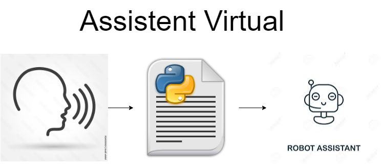

<h1 align="center">


<h3> <p align="center"> Assistent Virtual </p> </h3>
<h3> <p align="center"> ================= </p> </h3>

>> <h3> Solution Architecture </h3>




>> <h3> Description </h3>

<p> This project is particularly a mini baby! Since I met Alexa, Amazon's virtual assistant,
I studied how to create my own. And here's the project.
It's still in the process of progression, at the moment this virtual assistant (which in this project can have the name you want)
performs simple tasks such as opening web pages, performing google queries, watching a video on youtube and responding to the date and time with an occasional greeting.
I intend, as far as possible, to expand its functions to other services that will help us in our day-to-day.
Enjoy this project!</p>

>> <h3> How to Run </h3>

in your terminal (linux ou mac) run:

```
source start.sh

```
